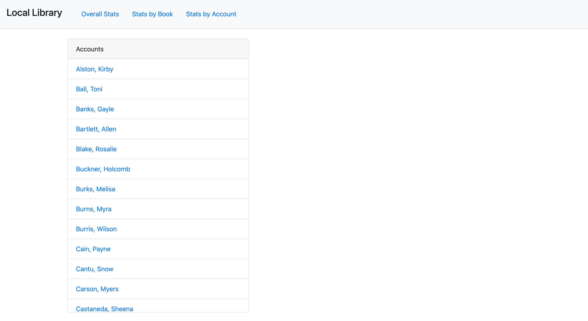

# Local Library Project

A Thinkful project, we were tasked with creating a variety of complex functions to output various data related to a local library.  

## Home Page
  

## Books Page
  

## Accounts Page
  

## Link

https://nathanielhotchkiss.github.io/Local-Library/

## Technology

Built with Javascript  
Styled with Bootstrap
